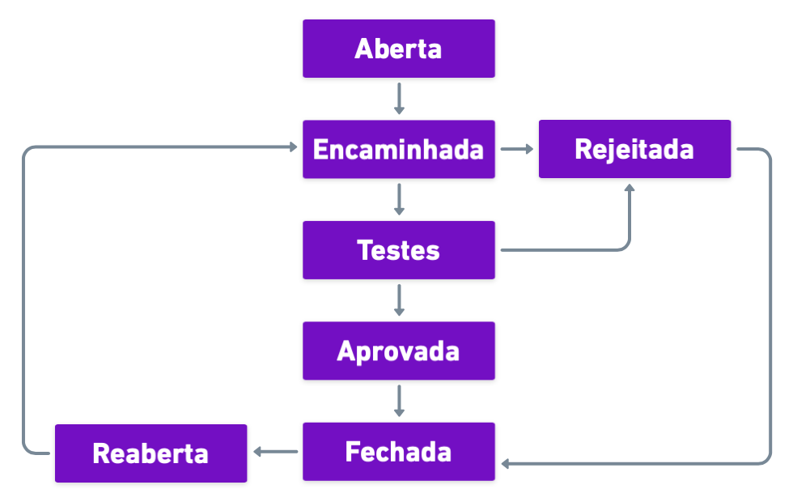
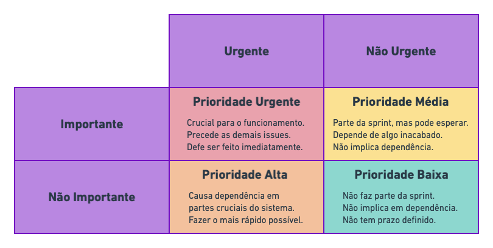
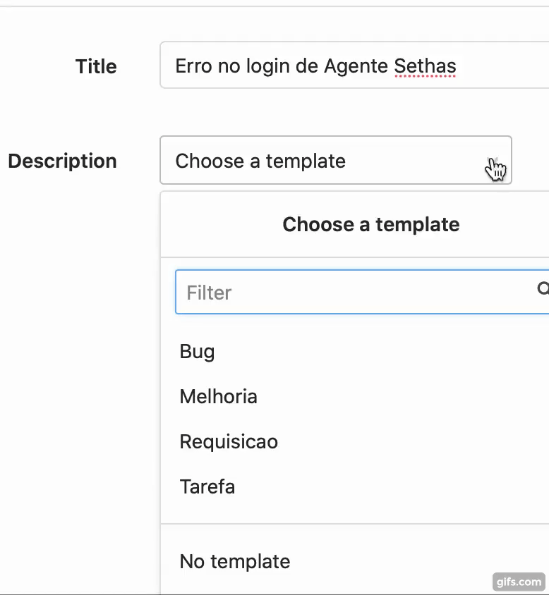
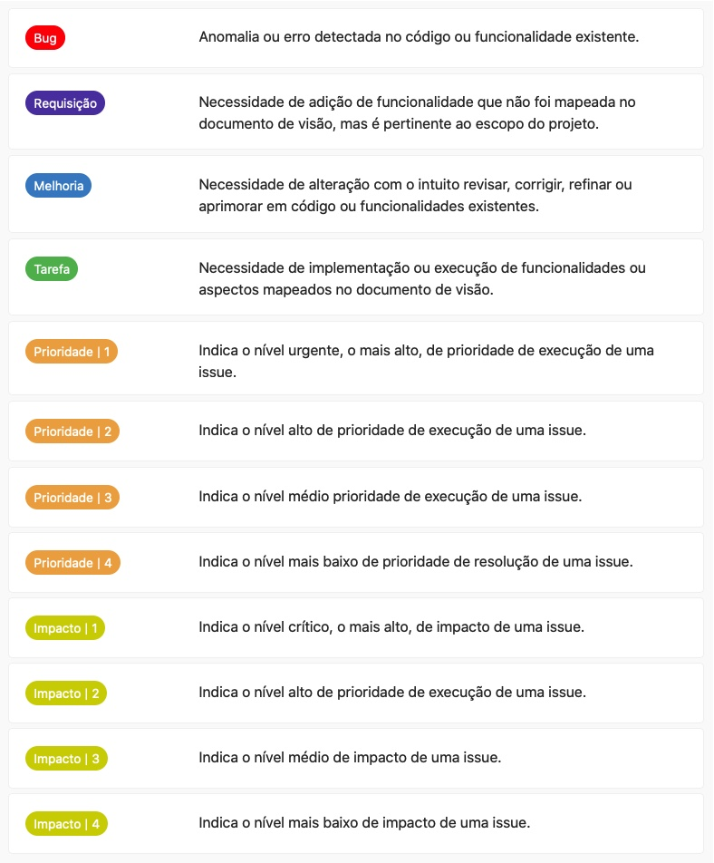
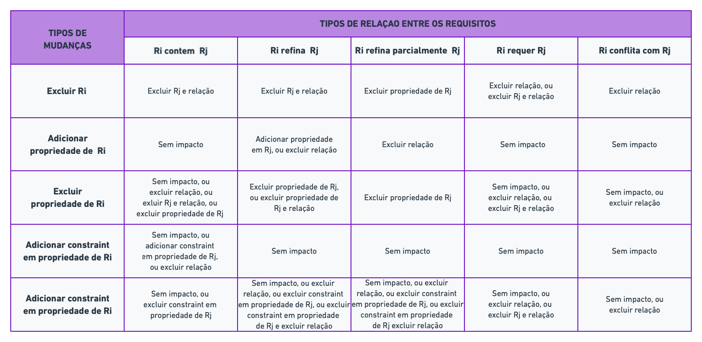

# Issues

Em desenvolvimento de software, uma issue pode ser definida como a unidade de trabalho necessária para atingir uma melhoria no sistema através de uma alteração. Em teste de software, uma issue é referenciada como um bug, problema ou defeito. Entretanto, o seu sentido é mais abrangente, podendo além desses significar uma requisição de mudança, uma tarefa, falta de documentação, etc.

## Ciclo de vida

O gerenciamento de uma issue é um processo que vai desde a sua adição até o seu fechamento, passando por várias [etapas](##Acompanhamento) como testes e até mesmo a reabertura. Tudo isso para que o resultado final seja compatível com a proposta de melhoria inicial.

  

É fundamental definir claramente uma issue, e principalmente, adicionar um cadastro por issue para cada issue detectada. Não se deve adicionar mais de uma issue por cadastro mesmo que estejam relacionadas. O ideal é que cada uma delas seja bem definida e o mais atômica possível.

Além disso, a forma como as issues são adicionadas é uma parte muito importante para o gerenciamento, pois as informações cadastradas são essenciais para o seu planejamento e implementação. A seguir, são especificados os aspectos principais que devem conter no cadastro de uma issue.

## Tipo

O tipo de uma issue é associado ao tipo de implementação necessária para a sua conclusão. Geralmente, quando uma issue está relacionada a um código existente, ela reporta um defeito (bug) ou uma melhoria. De modo semelhante, quando a issue trata de algo que ainda não foi implementado, ela se caracteriza como uma nova tarefa ou funcionalidade, ou uma solicitação. No modelo adotado, há quatro tipos de issue e correspondem a quatro templates distintos:

- **Bug** - Reporta uma anormalidade ou erro em uma base de código, ou funcionalidade existente.

- **Melhoria** - Sugere uma alteração em funcionalidades, ou código existente para, corrigir, ou refinar e aprimorar aspectos como desempenho, experiência do usuário, entre outros.

- **Requisição** - Reporta a necessidade de adição de uma funcionalidade que não está mapeada, mas é pertinente ao escopo do projeto.

- **Tarefa** - Reporta a necessidade de executar ou implementar uma funcionalidade ou aspecto já definidos (caso de uso) e ainda não implementados.

## Título

O título de uma issue deve ser descritivo e objetivo. Quando possível, é ideal que o seu conteúdo contenha uma chave de busca.

Exemplos:

**Mau exemplo 1:**

_O campo de busca gera erro quando se insere 50 ou mais caracteres e clica enter._

**Bom exemplo 1:**

_Erro na busca com mais de 50 caracteres._

Por que é melhor?

Porque é curto e objetivo. Os detalhes de ações como "inserir" e "clica enter" podem ser especificados em passos para reprodução.

**Mau exemplo 2:**

_Adicionar os comandos relacionados ao docker do ambiente de desenvolvimento e de produção no Makefile_

**Bom exemplo 2:**

_Adicionar suporte ao docker no Makefile_

Por que é melhor?

Assim como no exemplo anterior, é mais objetivo, deixando os detalhes para a descrição da requisição.

## Descrição

A descrição de uma issue está diretamente relacionada ao seu [tipo](##Tipo), mas deve, de maneira coerente, conter os detalhes do que deve ser alterado ou implementado, ou do comportamento anormal detectado e referenciar casos de uso, requisitos funcionais ou não-funcionais sempre que cabível. Assim, de acordo com o tipo da issue, a descrição deve:

- **Tarefa** - Mencionar o caso de uso/funcionalidade relacionada ao que será adicionado

- **Melhoria** - Relacionar a(s) funcionalidade(s) ou aspectos do sistema impactados e quais os benefícios que a mudança trará.
- **Solicitação** - De forma semelhante à uma melhoria, deve-se detalhar o que precisa ser feito, o possível impacto e os resultados esperados.Exemplos: …

- **Bugs** - Os bugs constituem um tipo especial de issues e precisam de informações mais específicas e detalhadas em sua descrição. É necessário, entre outras coisas, detalhar qual o comportamento e quando foi observado, qual funcionalidades o apresenta, bem como as configurações de ambiente, versão do código e os passos para se reproduzir a anomalia. Assim, os principais aspectos presentes na descrição de um bug são:

  - **Data** - a data que o problema foi observado.

  - **Passos para reprodução** - caminho do arquivo, url da página, endpoint e a sequência de ações (menus, formulários, funcionalidades, conteúdo, caso de teste…)

  - **Condições do sistema** - tipo de usuário, credenciais, conexão, variáveis de ambiente (desenvolvimento ou produção), serviço reiniciado, condições do banco (ambiente de desenvolvimento, testes), dados fictícios (seeds), dados reais, ids dos registros….

  - **Versão da aplicação** - build, release, branch etc,

  - **Configurações do ambiente** - Dispositivo e/ou sistema operacional, memória RAM, browser e versão, dimensão e resolução da tela.

  - **Resultados esperados** - de acordo com o caso de uso, ou o entendimento pessoal da funcionalidade, como o sistema deve se comportar, qual deveria ser a resposta.

  - **Resultados observados** - qual o comportamento/resposta atual do sistema.

  - **Anexos** - adicionar prints ou vídeos, logs e todo tipo de imagem que ajude a descrever mais detalhadamente o problema.

Obs.: Além do caso de uso, uma issue também pode fazer menção a outras issues com as quais tenham algum tipo de relação, ou dependência.

Exemplos:

A seguir é feita a comparação de bons e maus exemplos de passos para a reprodução de um bug.

**Mau exemplo 1:**

Insira um endereço de e-mail válido no campo Newsletter no rodapé e clique em “enviar”.

**Bom exemplo 1:**

1. Como um visitante não conectado, acesse a página inicial: http://mywebsite.com;
2. Vár para o rodapé;
3. No campo Newsletter, insira um endereço de e-mail válido;
4. Clique em “enviar”;
5. Observe que você tem que fazer login.

Por que é melhor?

- A URL está presente - indica o site, a página e o ambiente do teste;
- O perfil do usuário é identificado - visitante não conectado;
- O meio não é mencionado, mas as etapas não seriam alteradas pelo dispositivo;
- A ordem lógica: “Insira um endereço de e-mail válido” não é a primeira ação que um usuário deve fazer para detectar o bug. Antes é necessário ir para o rodapé.

**Mau exemplo 2:**

1. Vá para a página inicial;
2. Passe o mouse sobre “informações e contato” no menu;
3. Clique em "LABEL";
4. Observe o título principal.

**Bom exemplo 2:**

1. Accesse http://mywebsite.com/info-contact/label;
2. Observe o título principal.

Por que é melhor?

Explicar como acessar uma página web quando a URL está disponível é uma perda de tempo. Nesse caso, a objetividade é sempre melhor, pois facilita o entendimento e economiza o tempo de todo mundo.

**Mau exemplo 3:**

1. Acesse http://mywebsite.com/page1;
2. Observe que o campo agora está vazio, embora tenha sido preenchido antes;
3. E mesmo assim, conectou-se com o usuário USER1.

**Bom exemplo 3:**

1. Acesse http://mywebsite.com/page1;
2. Logue como USER1: LOGIN, PASSWORD;
3. Observe que o campo está preenchido;
4. Vá para http://mywebsite.com/page2;
5. Faça a ação AÇÃO 1;
6. Volte para http://mywebsite.com/page1;
7. Observe que o campo agora está vazio;

Por que é melhor?

Porque cita a ação que gerou o bug e especifica como realizá-la. Contrariamente, no “mau exemplo 3”, foi descrita apenas a última parte das etapas. Ainda assim, é necessário inspecionar um pouco mais o problema para saber exatamente o que está errado, mas economiza muito mais tempo para quem irá fazê-lo.

## Impacto

O impacto de uma issue está relacionado à quantidade e o nível de trabalho exigido na sua execução. A análise do impacto deve identificar as possíveis consequências das alterações a serem feitas, ou uma estimativa do que precisa ser modificado. O principal objetivo da análise de impacto é identificar as partes do código que serão afetadas e qual o nível de dificuldade associado.

- **Baixo** - Uma mudança simples que não alterar a funcionalidade de um modo geral ou outras funcionalidades dependentes. Exemplos: alterar a cor de um botão, aumentar o tamanho de uma fonte, mudar o espaçamento de um elemento, alterar o nome de uma propriedade ou método, etc.

- **Médio** - Mudanças que representam a adição de novas funcionalidades ou restruturação de funcionalidades existentes, que não influenciam ou pouco influenciam funcionalidades dependentes. Exemplos: adicionar, editar ou remover um método ou atributo em uma classe, adicionar, remover ou alterar uma coluna de uma tabela no banco de dados. Criar um novo endpoint, alterar o nome de uma classe ou tabela em classes que não tem alta dependências com outras.

- **Alto** - Uma mudança que interfere significativamente em funcionalidades dependentes, sendo necessário alterar diversas classes, métodos, tabelas e casos de teste. Implementar um novo caso de uso, correspondente a uma dependência entre duas ou mais funcionalidades. Exemplo: editar permissões de um perfil de usuário.

- **Crítico** - Alteração que influencia drasticamente diversas funcionalidades e, até mesmo, requisitos de qualidade ou não-funcionais. É necessário alterar diversas classes ou módulos, reescrever e adicionar casos de testes, repensar a arquitetura do sistema etc. Exemplo: integração com api, autenticação, redesign do template etc.

## Prioridade

A prioridade de uma issue reflete a importância e o valor que ela agrega ao sistema ou projeto, bem como o nível de urgência com o qual deve ser executada. No processo adotado, issues relacionadas aos casos de uso sendo trabalhados no momento sempre terão maior prioridade. Esta, por sua vez, deve refletir a sua relevância para a conclusão dos mesmos tendo em vista os prazos a serem cumpridos.

Uma ótima forma de definir a prioridade de uma issue é utilizar a [matriz de prioridades de Eisenhower](https://www.dropbox.com/pt_BR/business/resources/eisenhower-matrix), que relaciona o nível de importância de algo a ser feito

  

- **Baixa** - o sistema ou funcionalidade não são afetados diretamente. Os casos de uso referentes não são prioritários. Ou ainda, depende de funcionalidades ainda não implementadas.

- **Média** - o sistema ou funcionalidade podem, mas não necessariamente, ser afetados diretamente. Os casos de uso referentes são prioritários, mas pode haver dependência com funcionalidades ainda não implementadas.

- **Alta** - funcionalidades principais dos casos de uso prioritários. Afeta diretamente o funcionamento do sistema ou funcionalidade.

- **Urgente** - Funcionalidade de extrema dependência, sem a qual nenhuma outra pode ser implementada. No caso de um bug, o problema paralisa o sistema ou impede completamente o uso de uma funcionalidade, gera inconsistência de dados ou lógica de negócio.

## Milestone

Uma Milestone é um referencial específico de tempo no ciclo de vida de um projeto e é usada para medir o progresso em direção ao seu objetivo final. Geralmente, elas são definidas pelo gerente ou responsável pelo andamento do projeto e em muitos casos, correspondem a exigências específicas e diretas do cliente.

As milestones também ajudam a equipe de desenvolvimento a entender a estrutura do projeto. Ao adicionar os marcos, é necessário entender que cada etapa corresponde a um elemento visível e funcional da aplicação e que eles definem uma sequência de implementação de funcionalidades e, frequentemente, uma função depende de outra. Assim, uma das uma das formas mais eficazes de organizar um projeto é interconectar as tarefas com os objetivos.

Uma outra forma de encarar as milestones é como pontos de verificação ao longo do projeto. A inserção desses pontos de verificação no cronograma permite a todos entrar em sincronia com os objetivos e resultados gerais do projeto e ainda, ajuda a garantir que os prazos críticos do projeto sejam cumpridos.

Muitos projetos de software possuem fases parecidas e algumas milestones são bastante comuns, como por exemplo: levantamento de requisitos, validação de requisitos, planejamento, implementação, teste de qualidade, testes de homologação do usuário, deploy ou implantação, suporte e muitos outros.

## Encaminhamento

Quando possível, e principalmente, dependendo da prioridade e do impacto de uma issue, é fundamental designar um responsável e determinar um prazo para resolvê-la o quanto antes. Se o prazo não for definido, mas uma milestone for adicionada, o prazo da issue deve ser o mesmo do da milestone. O responsável, por sua vez, deve atualizar o status da issue sempre que cabível, o que muitas vezes é feito de maneira automática, dependendo das ferramentas utilizadas.

## Acompanhamento

O acompanhamento monitora as transições entre os diferentes [estágios](##Ciclo) do ciclo de vida de uma issue e é representado pelo status. Este, por sua vez, está diretamente relacionado ao processo de gerenciamento adotado pela equipe. Aqui, o status de uma issue assume os seguintes valores:

- **Aberta**: A issue é adicionada, mas nenhum responsável é designado e o prazo pode ou não ser definido.

- **Encaminada**: Um responsável é designado e o prazo é definido.

- **Rejeitada**: Durante a implementação, o responsável pode verificar que a issue já foi resolvida, ou não a funcionalidade não é mais necessária e portanto, rejeitar a issue.

- **Testes**: As alterações no código são compartilhadas com a equipe e os responsáveis pelos testes avaliam as mudanças.

- **Aprovada**: O mínimo de pessoas responsáveis pela aprovação concluem que as alterações no código satisfazem as necessidades da issue e devem ser incorporadas ao restante da base de código.

- **Reaberta**: Ao contrário de _Aprovada_, um ou mais responsáveis pela avaliação das alterações concluem que estas não são suficientes para a conclusão da issue e o comunicam ao responsável.

- **Concluída**: Após aprovada, um responsável integra as alterações da issue à base de código do sistema.

## Templates

O modelo adotado fornece quatro tipos de templates de issues disponíveis no formulário de cadastro e correspondentes aos quatro [tipos](##Tipos) de issue definidos. Eles são um guia, explicitando quais as informações necessárias de acordo com as aspectos especificados. Basta selecionar o template e editar o texto em **markdown** gerado de acordo com o que achar viável. É importante adicionar o máximo de informações relevantes, pois eles foram refinados para constar tudo o que é necessário.

  

## Labels

No modelo adotado, as labels servem como filtros, indicadores ou meio de contextualização e categorização das issues. Elas auxiliam na organização e a triagem do gerenciamento, principalmente na parte de visualização das [issue boards](https://docs.gitlab.com/ee/user/project/issue_board.html).

As labels no **gitlab** são diferenciadas em duas categorias gerais: **group labels** que podem ser aplicadas à qualquer projeto pertencente à um grupo e **project labels** que são exclusivas de um projeto específico.

  

## Apêndice

### Análise de Impacto

De um modo geral, a análise de impacto de uma alteração identifica quais os componentes que devem ser criados, alterados ou eliminados, quais os riscos atrelados e qual nível de esforço associado à implementação da mudança. Geralmente, a análise de impacto pode ser dividida em duas partes distintas:

- **Rastreabilidade** - Deve-se considerar a associação entre os requerimentos, especificações (casos de uso), elementos de design e testes. De uma forma geral, define o escopo inicial da mudança proposta.

- **Dependência** - Levantamento do nível de dependência entre os elementos de código (variáveis, funções, lógica, módulos, configurações, etc.) a serem alterados e quais as consequências de uma possível mudança.

A seguir, é proposto um modelo de análise de impacto:

Dados o conjunto de todos os requisitos _R_ de um sistema e as formas mais comuns de relacionamento entre eles: **requer**, **refina**, **refina parcialmente**, **contém** e **conflita**, tem-se:

- **Requisito**: descrição de uma propriedade ou propriedades do sistema que precisam ser satisfeitas.

- **Requer**: Um requisito **R1** requer um requisito **R2** se **R1** é cumprido apenas quando **R2** é cumprido.

- **Refina**: Um requisito **R1** refina um requisito **R2** se **R1** é derivado de **R2** adicionando mais detalhes às suas propriedades.

- **Contém**: Um requisito **R1** contém os requisitos **R2 ... Rn** se **R2 ... Rn** são partes do todo **R1** (hierarquia parte-todo).

- **Refina parcialmente**: Um requisito **R1** refina parcialmente um requisito **R2** se **R1** é derivado de **R2** adicionando mais detalhes às propriedades de **R2** e excluindo as propriedades não refinadas de **R2**.

- **Conflita**: Um requisito **R1** está em conflito com um requisito **R2** se o cumprimento de **R1** exclui o cumprimento de **R2**.

Na maioria dos, casos as mudanças nos requisitos ocorrem por dois motivos:

- **Refatoração**: Refatorar é uma mudança ou conjunto de mudanças para melhorar a estrutura do modelo de requisitos sem modificar as propriedades gerais do sistema. Essas mudanças não afetam as propriedades no modelo todo.

- **Mudanças de domínio**: As mudanças de domínio são as mudanças para alterar as propriedades gerais do sistema no modelo de requisitos. Essas mudanças afetam as propriedades de todo o modelo de requisitos.

Já os tipos mais comuns de mudanças de requisitos são:

- Adicionar uma nova relação de requisitos
- Excluir relação de requisitos
- Atualizar relação de requisitos
- Adicionar um novo requisito
- Excluir Requisito
- Atualizar Requisito
  - Adicionar propriedade ao requisito
  - Adicionar constraint à propriedade do requisito
  - Alterar propriedade do requisito
  - Alterar constraint da propriedade do requisito
  - Excluir propriedade do requisito
  - Excluir constraint da propriedade do requisito

Com isso, para dois requisitos quaisquer Ri e Rj, é possível mapear o impacto de uma mudança de domínio em Ri de acordo com o tipo de relação entre eles.

  

## Referências

https://www.dropbox.com/pt_BR/business/resources/eisenhower-matrix 
https://evernote.com/blog/pt-br/trabalhe-melhor-com-a-matriz-de-eisenhowertrabalhe-melhor-com-a-matriz-de-eisenhower/ 
https://blog.trello.com/br/matriz-de-eisenhower 
https://www.lattix.com/managing-code-change-with-impact-analysis/ 
https://www.eisenhower.me/eisenhower-matrix/ 
https://www.dropbox.com/pt_BR/business/resources/eisenhower-matrix 
https://arxiv.org/pdf/1608.02757.pdf 
https://www.sciencedirect.com/science/article/pii/S1319157816300167#b0040 
https://www.tutorialspoint.com/software_testing_dictionary/issues.htm 
https://medium.com/we-are-testers/chapter-4-how-to-write-clear-and-efficient-steps-to-reproduce-in-your-bug-report-d96039a1c77d 
https://www.open.collab.net/nonav/scdocs/ProjectIssues.html 
https://www.open.collab.net/nonav/scdocs/issuewritinghelp.html 
https://www.open.collab.net/nonav/scdocs/issue_lifecycle.html 
https://www.open.collab.net/nonav/scdocs/issuewritinghelp.html 
https://soltech.net/what-are-8-milestones-every-software-project-should-have 
https://www.ekreative.com/blog/role-milestones-software-development/ 
https://www.wrike.com/project-management-guide/faq/why-should-i-use-milestones-in-project-management-software/ 
https://www.ekreative.com/blog/role-milestones-software-development/ 
https://hackernoon.com/45-github-issues-dos-and-donts-dfec9ab4b612 
https://blog.zenhub.com/best-practices-for-github-issues/ 
https://medium.com/nyc-planning-digital/writing-a-proper-github-issue-97427d62a20f 
https://docs.gitlab.com/ee/user/project/labels.html#scoped-labels 
https://docs.gitlab.com/ee/api/labels.html 
https://about.gitlab.com/blog/2016/08/17/using-gitlab-labels/ 
https://docs.gitlab.com/ee/development/contributing/issue_workflow.html 
https://docs.gitlab.com/ee/user/project/issue_board.html
